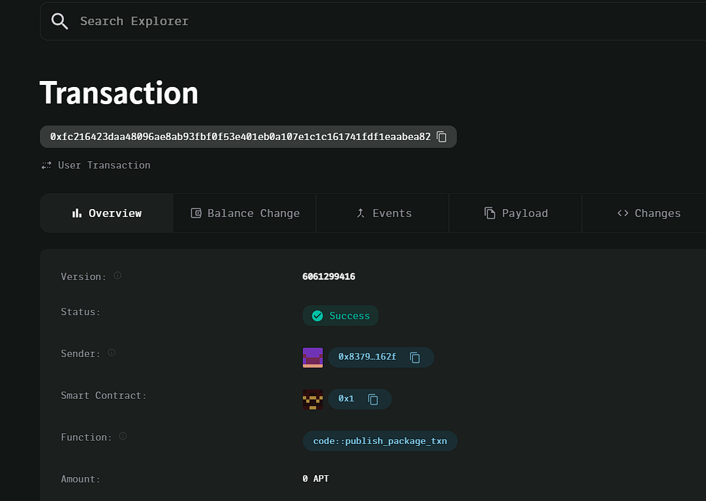

### Deployed smartcontract address: 0xfc216423daa48096ae8ab93fbf0f53e401eb0a107e1c1c161741fdf1eaabea82

### Screenshot: 

# Rental Agreement Manager

## Project Description
The Rental Agreement Manager platform is a decentralized solution for creating and managing rental agreements. It enables landlords and tenants to manage deposits, rent payments, and contractual obligations securely using blockchain technology.

## Vision
To create a transparent, immutable, and secure platform for managing rental agreements, ensuring that both landlords and tenants can trust the system for payments and deposits.

## Key Features
- **Rental Agreements**: Landlords can create rental agreements specifying the deposit and rent due.
- **Rent Payments**: Tenants can pay rent directly to landlords on a decentralized platform.
- **Deposit Handling**: Secure management of deposits using blockchain.

## Future Scope
- **Automated Payment Reminders**: Notify tenants when rent is due.
- **Dispute Resolution**: Implement a system for resolving disputes between landlords and tenants.
- **Multi-Currency Support**: Allow payments in different cryptocurrencies.
